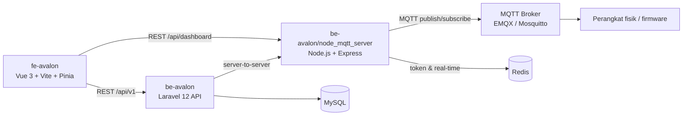

# Arcadia — Project Avalon (Platform IoT)

Platform IoT untuk **monitoring sensor & kontrol pompa air** secara real-time: dashboard petani, manajemen device (QR/barcode), kalender alarm terjadwal, notifikasi, dan grafik data sensor. Backend di-orchestrasi lewat bridge MQTT ke perangkat fisik.

📚 **Dokumentasi lengkap (wiki)**: [GitHub Wiki](https://github.com/tutupharirabu/Arcadia-ProjectAvalon/wiki) — arsitektur, alur branch/rilis, CI/CD, keamanan, dan troubleshooting.

## Arsitektur



| Komponen | Stack | Dokumen |
|---|---|---|
| `be-avalon` | Laravel 12.65 API (JWT auth, scheduler alarm, notifikasi) | [README](be-avalon/README.md) |
| `be-avalon/node_mqtt_server` | Node.js bridge MQTT ↔ Laravel (2 proses: monitoring & watering) | [README](be-avalon/node_mqtt_server/README.md) |
| `fe-avalon` | Vue 3 + Vite + Pinia + Tailwind/daisyUI + Chart.js | [README](fe-avalon/README.md) |

## Alur Branch (SDLC)

```
improvement/* (fitur/perbaikan)
        └─▶ PR → dev (integrasi)
                  └─▶ PR → canary (staging/pre-prod)
                            └─▶ PR → main (produksi)
```

- **`main`** — produksi; **default branch**.
- **`canary`** — staging; pratinjau sebelum produksi.
- **`dev`** — integrasi semua fitur; `dev-be` & `dev-fe` untuk kerja per-area (backend/frontend).

`canary` & `main` dilindungi branch protection: perubahan wajib lewat PR, **CI 3 job hijau** (Backend Laravel, Frontend Vue, Node bridge) + branch up-to-date (strict). Rincian alur & pola rilis: [Wiki — SDLC & Branch](https://github.com/tutupharirabu/Arcadia-ProjectAvalon/wiki/SDLC-Branch-Strategy).

## Quick Start (lokal)

```bash
# 1) Backend API (port 8000)
cd be-avalon
cp .env.example .env   # isi DB, JWT_SECRET, SHARED_SECRET, dll.
composer install
php artisan key:generate
php artisan migrate --seed
php artisan serve

# 2) Node bridge MQTT (port 3000 & 3001) — butuh Redis + broker MQTT
cd be-avalon/node_mqtt_server
npm install
npm start              # serverMonitoring.js (port 3000)
node serverWatering.js # proses kedua (port 3001)

# 3) Frontend (port 5173)
cd fe-avalon
npm install
cp .env.example .env   # VITE_API_URL / VITE_NODE_URL (default: localhost)
npm run dev
```

> **Penting:** `SHARED_SECRET` harus bernilai **SAMA** di `.env` Laravel dan `.env` node server (endpoint server-to-server fail-closed). Detail lengkap di README masing-masing komponen.

## Deploy (VPS)

- **Backend**: nginx + PHP-FPM (root `public/`), Redis, cron `php artisan schedule:run` tiap menit.
- **Node bridge**: 2 proses Node (port 3000/3001) via systemd/PM2.
- **Frontend**: build statis `npm run build` → root `dist/` + SPA rewrite `try_files $uri /index.html`.
- Set env produksi: `APP_DEBUG=false`, `JWT_SECRET`, `SHARED_SECRET`, `NODE_API_URL_1/2`, `FRONTEND_URL`, `VITE_API_URL`, `VITE_NODE_URL`.

## Keamanan

- Ownership data diverifikasi di semua endpoint (trait `HasOwnershipChecks`) — anti-IDOR.
- Rate limiting: `throttle:api` (60/menit) + `throttle:auth` (5/menit) untuk login/OTP/forgot-password; endpoint Node bridge pakai `express-rate-limit` (60/15 menit).
- Endpoint server-to-server node memakai `x-shared-secret` (constant-time, fail-closed).
- Token JWT di-blacklist saat logout; password bcrypt (12 rounds).
- CORS dipin ke `FRONTEND_URL`; `.env` ter-gitignore di semua komponen.
- Validasi `deviceId` di bridge MQTT (anti-SSRF); kredensial tidak di-log; Dependabot security updates & CodeQL Advanced aktif (0 alert terbuka).
- Riwayat lengkap hardening: [Wiki — Keamanan](https://github.com/tutupharirabu/Arcadia-ProjectAvalon/wiki/Keamanan).

## Testing

```bash
cd be-avalon && php artisan test          # 18 test (auth, IDOR, rate limit, alarm, admin-gate)
cd fe-avalon && npm run test:unit         # Cypress component
```

## CI/CD

Workflow aktif: **CI** (3 job bertahap), **CodeQL Advanced**, **Copilot**, **Dependabot Updates**, **GitHub Advanced Security** — detail di [Wiki — CI/CD](https://github.com/tutupharirabu/Arcadia-ProjectAvalon/wiki/CI-CD).

## Status Audit

Riwayat audit & perbaikan terdokumentasi di [`be-avalon/AUDIT-PERBAIKAN.md`](be-avalon/AUDIT-PERBAIKAN.md) dan [Wiki — Troubleshooting](https://github.com/tutupharirabu/Arcadia-ProjectAvalon/wiki/Troubleshooting).

## API Documentation

Dokumentasi endpoint API (Laravel & Node) tersedia di Postman: **https://documenter.getpostman.com/view/36245125/2sAYBREtgh**
