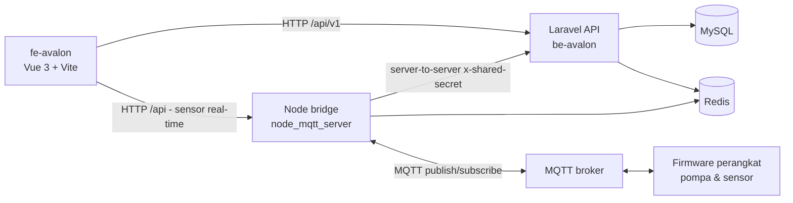

# be-avalon — Backend Platform IoT

Backend API (Laravel 11) untuk platform IoT Avalon: kontrol pompa air, monitoring sensor, notifikasi, dan alarm terjadwal. API melayani frontend Vue (`fe-avalon`) dan dijembatani ke perangkat fisik (firmware) melalui servis Node.js (`node_mqtt_server`) yang menghubungkan ke broker MQTT.

## Arsitektur



- **Laravel API** — autentikasi JWT (`tymon/jwt-auth`), otorisasi kepemilikan per-user, notifikasi, alarm pompa, endpoint data historis sensor.
- **Node bridge** — dua proses Express: `serverMonitoring.js` (ingest data sensor MQTT → Laravel + Redis) dan `serverWatering.js` (kontrol pompa: Laravel/UI → MQTT → firmware). Semua endpoint server-to-server dilindungi header `x-shared-secret`.
- **Frontend** — repositori terpisah: [`fe-avalon`](../fe-avalon/README.md).

## Requirements

| Tool | Versi | Keterangan |
|---|---|---|
| PHP | ^8.2 | lihat `composer.json` |
| Composer | 2.x | |
| MySQL | 8.x / MariaDB 10.4+ | database utama |
| Redis | 6.x+ | sesi, cache, data sensor, token device |
| Node.js | >= 22 | hanya untuk `node_mqtt_server` |
| MQTT broker | EMQX / Mosquitto | hanya untuk `node_mqtt_server` |

## Setup Lokal

### 1. Backend API

```bash
cd be-avalon
composer install
cp .env.example .env
php artisan key:generate
php artisan jwt:secret        # generate JWT_SECRET untuk .env
php artisan migrate
php artisan db:seed           # opsional: RoleSeeder, UserSeeder
php artisan serve             # http://localhost:8000
```

Vite (asset) dijalankan terpisah: `npm install && npm run dev` (atau `composer run dev` untuk serve + queue + vite sekaligus).

### 2. Node bridge (MQTT)

```bash
cd be-avalon/node_mqtt_server
npm install
# buat file .env (lihat node_mqtt_server/README.md — tidak ada .env.example)
npm start                     # serverMonitoring.js (monitoring)
node serverWatering.js        # proses kedua (kontrol pompa) — terminal/jendela terpisah
```

> **Penting:** `SHARED_SECRET` di `.env` Laravel dan `.env` node server **harus sama** — ini dipakai otentikasi server-to-server.

### 3. Frontend

```bash
cd fe-avalon
npm install
cp .env.example .env          # set VITE_API_URL / VITE_NODE_URL
npm run dev
```

## Environment Variables

Daftar lengkap dari `.env.example`:

| Variable | Deskripsi |
|---|---|
| `APP_NAME` | Nama aplikasi |
| `APP_ENV` | `local` / `production` / `testing` |
| `APP_KEY` | Kunci enkripsi Laravel (`php artisan key:generate`) |
| `APP_DEBUG` | Tampilkan error detail — **wajib `false` di produksi** |
| `APP_TIMEZONE` | Zona waktu aplikasi |
| `APP_URL` | URL publik API |
| `APP_LOCALE` / `APP_FALLBACK_LOCALE` / `APP_FAKER_LOCALE` | Lokalisasi & faker |
| `APP_MAINTENANCE_DRIVER` | Driver mode maintenance (`file`) |
| `PHP_CLI_SERVER_WORKERS` | Worker `php artisan serve` |
| `BCRYPT_ROUNDS` | Cost hashing password (12) |
| `LOG_CHANNEL` / `LOG_STACK` / `LOG_DEPRECATIONS_CHANNEL` / `LOG_LEVEL` | Konfigurasi logging |
| `DB_CONNECTION` / `DB_HOST` / `DB_PORT` / `DB_DATABASE` / `DB_USERNAME` / `DB_PASSWORD` | Koneksi MySQL |
| `SESSION_DRIVER` / `SESSION_LIFETIME` / `SESSION_ENCRYPT` / `SESSION_PATH` / `SESSION_DOMAIN` | Sesi (database) |
| `BROADCAST_CONNECTION` / `FILESYSTEM_DISK` / `QUEUE_CONNECTION` | Driver broadcast/queue/filesystem |
| `CACHE_STORE` / `CACHE_PREFIX` | Cache (database) |
| `MEMCACHED_HOST` | Host Memcached (jika dipakai) |
| `REDIS_CLIENT` / `REDIS_HOST` / `REDIS_PASSWORD` / `REDIS_PORT` / `REDIS_URL` | Koneksi Redis |
| `MAIL_MAILER` / `MAIL_HOST` / `MAIL_PORT` / `MAIL_USERNAME` / `MAIL_PASSWORD` / `MAIL_ENCRYPTION` / `MAIL_FROM_ADDRESS` / `MAIL_FROM_NAME` | Email (OTP, notifikasi) |
| `JWT_SECRET` | Rahasia JWT — generate via `php artisan jwt:secret` |
| `JWT_TTL` / `JWT_REFRESH_TTL` | Umur token (menit) & refresh TTL |
| `JWT_ALGO` / `JWT_LEEWAY` | Algoritma & leeway JWT |
| `JWT_BLACKLIST_ENABLED` / `JWT_BLACKLIST_GRACE_PERIOD` | Blacklist token (logout) |
| `JWT_PUBLIC_KEY` / `JWT_PRIVATE_KEY` / `JWT_PASSPHRASE` | Key RSA (jika pakai asimetris) |
| `NODE_API_URL_1` / `NODE_API_URL_2` | URL servis `node_mqtt_server` (dipanggil server-to-server dari controller) |
| `MQTT_USERNAME` / `MQTT_KEY` | Kredensial broker MQTT (dipakai `node_mqtt_server`) |
| `CLOUDINARY_CLOUD_NAME` / `CLOUDINARY_API_KEY` / `CLOUDINARY_API_SECRET` | Cloudinary — upload QR device |
| `FRONTEND_URL` | Origin FE yang diizinkan CORS (bisa comma-separated) |
| `AWS_ACCESS_KEY_ID` / `AWS_SECRET_ACCESS_KEY` / `AWS_DEFAULT_REGION` / `AWS_BUCKET` / `AWS_USE_PATH_STYLE_ENDPOINT` | S3 (jika dipakai) |
| `VITE_APP_NAME` | Nama app untuk asset Vite |
| `SHARED_SECRET` | **Secret bersama Laravel ↔ `node_mqtt_server`** — nilai HARUS sama di kedua `.env` |

## Perintah Penting

```bash
php artisan serve                  # jalankan API lokal
php artisan test                   # test suite (Pest/PHPUnit)
php artisan schedule:run           # jalankan scheduler (check:alarms tiap menit)
php artisan migrate                # jalankan migrasi
php artisan db:seed                # seed data
```

Scheduler produksi: daftarkan `php artisan schedule:run` di cron tiap menit (mis. `* * * * * cd /path/be-avalon && php artisan schedule:run >> /dev/null 2>&1`).

## Deploy (VPS)

1. `php artisan config:cache` aman dijalankan — seluruh konfigurasi sudah memakai `config()` (bukan `env()` langsung di controller), dan `.env.example` sudah lengkap.
2. **Wajib ter-set di environment produksi:** `APP_KEY`, `APP_DEBUG=false`, `DB_*`, `REDIS_URL`, `JWT_SECRET`, `SHARED_SECRET` (sama dengan node server), `NODE_API_URL_1`/`NODE_API_URL_2`, `FRONTEND_URL`.
3. Jalankan `php artisan migrate --force` sekali saat deploy.
4. Aktifkan scheduler via cron tiap menit (lihat "Perintah Penting").
5. Web server: nginx + PHP-FPM (root `public/`), SSL Let's Encrypt, dan proxy API ke node server jika diperlukan.

## Keamanan

- Semua endpoint kepemilikan data (device, log pompa, alarm, notifikasi, data historis) mengecek ownership via trait `HasOwnershipChecks` — user hanya bisa mengakses resource miliknya.
- Rate limiting: `throttle:api` (60/menit) global + limiter `auth` (5/menit) untuk login/OTP/forgot-password.
- Endpoint server-to-server node hanya menerima request dengan header `x-shared-secret` yang cocok.
- Jangan pernah meng-commit `.env` — file ini ter-gitignore.
