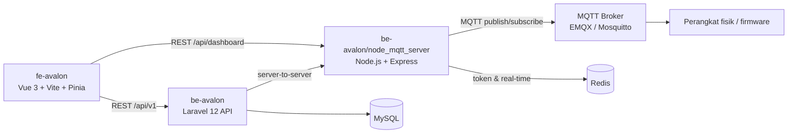

# 🏗️ Arsitektur

## Diagram Sistem

## Komponen

| Komponen | Path | Stack | Port |
|---|---|---|---|
| Backend API | `be-avalon/` | Laravel **12.65** (PHP ^8.2), JWT (`tymon/jwt-auth` 2.3), Sanctum 4.3, Scheduler, Redis | 8000 |
| Bridge MQTT — Monitoring | `be-avalon/node_mqtt_server/serverMonitoring.js` | Node.js + Express 4, MQTT, Redis, QR Code (Cloudinary) | 3000 |
| Bridge MQTT — Watering | `be-avalon/node_mqtt_server/serverWatering.js` | Node.js + Express 4, MQTT, Redis, Scheduler | 3001 |
| Frontend Dashboard | `fe-avalon/` | Vue 3 + Vite 8 + Pinia + Tailwind/daisyUI + Chart.js + Schedule-X | 5173 |

## Alur Data Utama

1. **Sensor → Dashboard**: perangkat mem-publish data ke broker MQTT → bridge (`serverMonitoring.js`) berlangganan wildcard `{user}/feeds/+` → data disimpan ke Redis → frontend mengambil via `GET /api/dashboard/:deviceId` (dengan token JWT dari Redis).
2. **Kontrol pompa**: frontend → Laravel API → bridge `serverWatering.js` → publish MQTT ke perangkat; log & alarm disimpan di database.
3. **Autentikasi**: Laravel menerbitkan JWT; token disimpan ke Redis via endpoint `POST /api/store-token` (dilindungi `x-shared-secret` server-to-server) untuk dipakai bridge saat validasi device.

## Peta Endpoint Node Bridge

| Endpoint | Middleware | Fungsi |
|---|---|---|
| `POST /api/store-token` | `apiLimiter` + `requireSharedSecret` | Simpan JWT user ke Redis (dari Laravel) |
| `GET /api/dashboard/:deviceId` | `apiLimiter` + `authenticateToken` | Ambil data real-time device dari Redis |

Kedua endpoint dilindungi **rate limit** (`express-rate-limit` 8.x): 60 permintaan / 15 menit per IP, dengan respons `429`.

## Variabel Lingkungan Penting

- **Laravel** (`be-avalon/.env`): `APP_KEY`, `DB_*`, `JWT_SECRET`, `SHARED_SECRET`, `MQTT_*`, `NODE_API_URL_1/2`, `FRONTEND_URL`
- **Node bridge** (`.env`): `MQTT_BROKER_URL`, `MQTT_USERNAME`, `MQTT_KEY`, `LARAVEL_API_URL`, `SHARED_SECRET`, `PORT_MONITOR` (3000), `PORT_WATER` (3001)
- **Frontend** (`fe-avalon/.env`): `VITE_API_URL`, `VITE_NODE_URL`

> ⚠️ `SHARED_SECRET` harus **sama persis** di Laravel dan kedua proses Node (endpoint server-to-server bersifat *fail-closed*).
